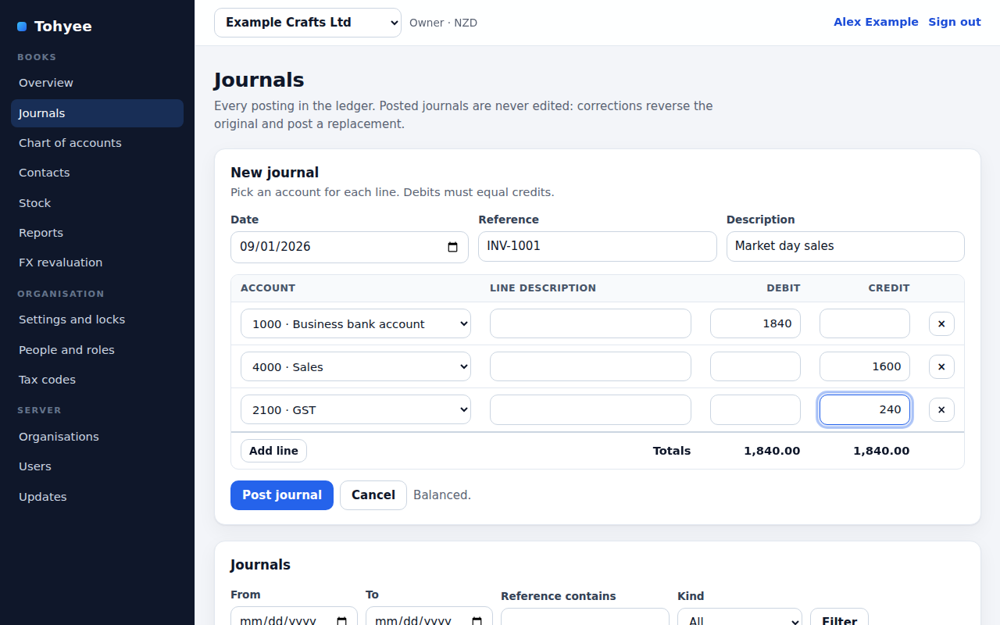
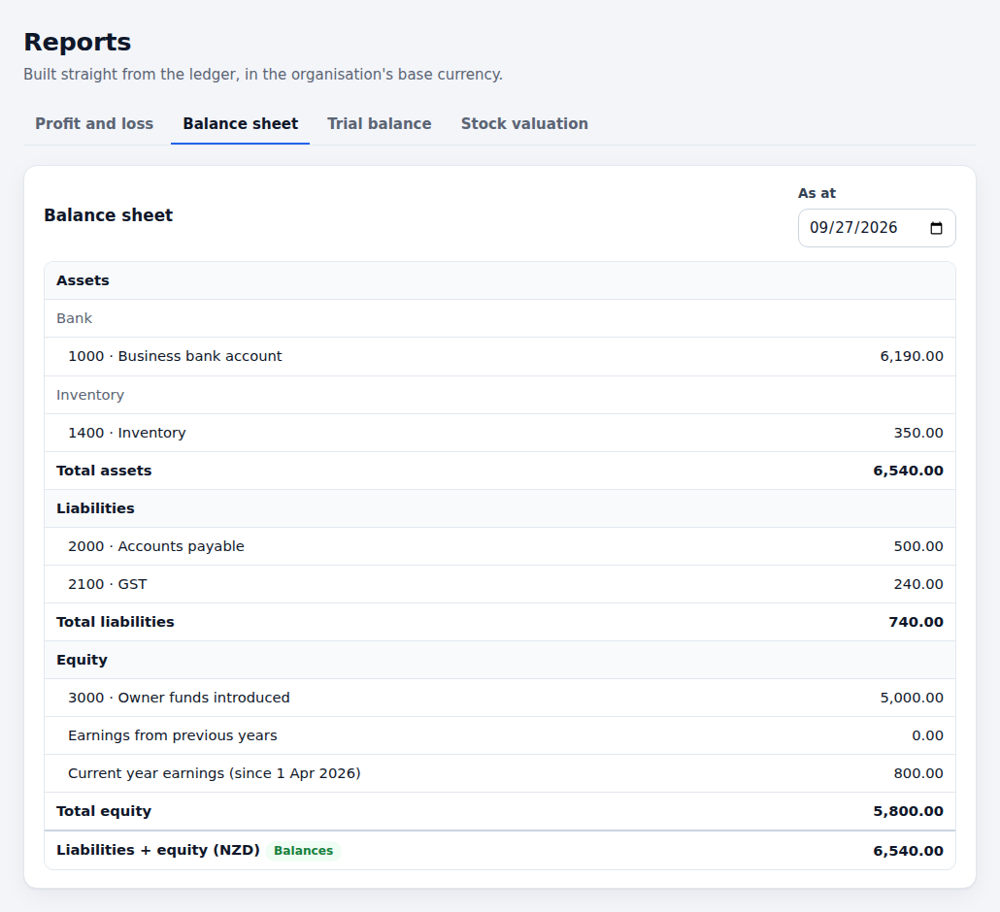

<p align="center">
  
</p>

<h1 align="center">Tohyee</h1>

<p align="center">
  Self-hosted, open-source accounting for New Zealand organisations.
</p>

<p align="center">
  <a href="https://github.com/Willy-nz/Tohyee/actions/workflows/ci.yml"></a>
  <a href="LICENSE"></a>
</p>

One Tohyee server hosts many organisations, and **each organisation gets its
own PostgreSQL database**, so each can be backed up, restored or moved on its
own.

> **Status: early development.** The features below work and are covered by
> tests, but Tohyee isn't ready for real bookkeeping yet. See
> [docs/FEATURES.md](docs/FEATURES.md) for what's built and what's next.

<p align="center">
  
</p>

## What works today

- **Organisations**, each in its own PostgreSQL database, created and repaired
  by server admins.
- **Logins and roles**: owner, admin, bookkeeper and viewer per organisation;
  first-time setup, lockout after repeated failed sign-ins, and an admin CLI
  for recovery.
- **General ledger**: a starting NZ chart of accounts, manual journals,
  corrections by reversal and replacement, and period locks. The database
  itself refuses unbalanced journals and edits to posted history.
- **Contacts**: customers and suppliers, archived rather than deleted.
- **Sales invoices** with GST worked out per line (tax exclusive, tax
  inclusive or no tax): drafts, approval that numbers the invoice
  (`INV-0001`, …) and posts it to the ledger, and voiding that reverses it.
- **Customer payments** against an approved invoice, into a bank account:
  each one posts to the ledger, part payments are fine, and the invoice shows
  what's still due. Overpayments aren't built yet.
- **Sales credit notes**: drafts, approval that numbers them (`CN-0001`, …)
  and posts them, credit applied to one or more of the customer's invoices,
  unused credit kept on the credit note or refunded from a bank account, and
  voiding.
- **Supplier payments** against an approved bill, from a bank account: each
  one posts to the ledger, part payments are fine, and the bill shows what's
  still due.
- **Supplier credit notes**: drafts carrying the supplier's credit note
  number, approval that posts them, credit applied to one or more of the
  supplier's bills, unused credit kept on the credit note or refunded by the
  supplier into a bank account, and voiding.
- **Stock**: receipts, sales, returns, stocktake adjustments and landed cost,
  with weighted-average costing to the cent.
- **Foreign-currency revaluation** of foreign-currency bank, asset and
  liability accounts, reversed automatically the next day.
- **Reports**: trial balance, profit and loss, balance sheet and stock
  valuation, with a financial year end you choose (31 March by default).
- **GST return** (GST101A, boxes 5-15) on the invoice basis for 1, 2 or 6
  months, worked out from approved and voided documents, with the lines in
  each box, Box 9 and 13 adjustments, and "Mark as filed", which stores the
  figures for good and shows if they've changed since. The payments and
  hybrid bases aren't built yet.

<p align="center">
  
</p>

## Run it locally

You need Node.js 22 or 24 and Docker (for PostgreSQL).

```bash
npm install
npm run db:start                  # PostgreSQL 17 on localhost:5432
cp .env.example .env.local        # then set SETUP_TOKEN to a long random value
npm run dev                       # http://localhost:3000
```

The first visit goes to **/setup**: enter the `SETUP_TOKEN` and create the
first server admin. Then create an organisation under **Organisations**. It
gets its own database with a starting NZ chart of accounts, and you're its
owner.

Database migrations run automatically when the server starts. To run them by
hand: `npm run db:migrate`.

## Checks

```bash
npm run lint
npm run typecheck
npm test                          # database tests need TEST_DATABASE_URL, see .env.example
npm run build
```

`npm test` includes the worked examples in
[docs/ACCOUNTING-EXAMPLES.md](docs/ACCOUNTING-EXAMPLES.md), run against a real
PostgreSQL database. CI runs all four checks on pull requests and pushes to
`main`, on Node 22 and 24 with PostgreSQL 17.

## Running on a server

**Windows:** download `tohyee-v<version>-windows.zip` from the
[latest release](https://github.com/Willy-nz/Tohyee/releases/latest), install
[Docker Desktop](https://www.docker.com/products/docker-desktop/), extract the
zip and double-click `Install-Tohyee.cmd`. It creates random passwords, starts
Tohyee and PostgreSQL, and opens first-time setup. Both restart by themselves
whenever Docker Desktop starts (after a restart, once you sign in). The zip's
`README.txt` covers backups, updates and network access; the files are in
[`deploy/windows`](deploy/windows).

**Docker:** the image is `ghcr.io/willy-nz/tohyee:<version>`. It needs
`DATABASE_URL` (a PostgreSQL 15+ login that can create databases) and, for the
first run, `SETUP_TOKEN`; it listens on port 3000.

**Linux without Docker:**

```bash
npm run build
npm run package:release           # dist/release/tohyee-v<version>-linux-x64.tar.gz
```

On the server, unpack the bundle, set `DATABASE_URL` (and `SETUP_TOKEN` for
the first run) in the environment, and start it with `PORT=3000 ./start.sh`.
Put it behind HTTPS (e.g. Caddy or nginx) if it's reachable beyond your own
network.

**Backups:** each organisation is a normal PostgreSQL database, so
`pg_dump -Fc -d tohyee_org_<id>` backs one up. Back up the core database
(`tohyee`) too. Built-in scheduled backups are on the roadmap.

**Locked out?** The admin commands work straight against the database. They
need a checkout of this repository (with `npm install` done) and
`DATABASE_URL` pointing at the server's core database; the release bundle
doesn't include them. The new password is read from `TOHYEE_PASSWORD` or asked
for when you run the command.

```bash
npm run admin -- set-password --email you@example.com
npm run admin -- create-user --email you@example.com --name "You" --server-admin
```

**Releases:** pushing a `v*` tag builds a release bundle and attaches it to a
GitHub release (`.github/workflows/release-server-bundle.yml`); the tag must
match the version in `package.json`. Server admins can check for new releases
under **Updates**.

## Documentation

- [docs/ARCHITECTURE.md](docs/ARCHITECTURE.md): tenancy, logins and roles,
  migrations, financial integrity rules
- [docs/ACCOUNTING-EXAMPLES.md](docs/ACCOUNTING-EXAMPLES.md): worked examples
  with numbers (the acceptance tests)
- [docs/FEATURES.md](docs/FEATURES.md): scope and roadmap
- [docs/STYLE-GUIDE.md](docs/STYLE-GUIDE.md): code conventions
- [.github/copilot-instructions.md](.github/copilot-instructions.md): rules for
  AI coding agents

## API

JSON over HTTP. Every route needs a signed-in session cookie, except
`/api/health`, sign-in, sign-out and first-time setup. Organisation routes take
an `organisationId` and check your role in that organisation. Commands that
create things take an `idempotencyKey`, so retries are safe. Browser requests
that change something are refused if they come from another site (checked with
the `Origin` and `Sec-Fetch-Site` headers).

| Area | Routes |
| --- | --- |
| Auth | `GET/POST /api/auth/setup`, `POST /api/auth/login`, `POST /api/auth/logout`, `GET /api/auth/session`, `POST /api/auth/password` |
| Server admin | `GET/POST /api/admin/organisations`, `PATCH /api/admin/organisations/:id`, `POST /api/admin/organisations/:id/repair`, `GET/POST /api/admin/users`, `PATCH /api/admin/users/:id`, `GET /api/updates/latest-release` |
| Organisation | `GET/PATCH /api/organisations/:id/settings`, `GET/POST /api/organisations/:id/members`, `PATCH/DELETE /api/organisations/:id/members/:userId` |
| Accounts | `GET/POST /api/accounts`, `PATCH /api/accounts/:id` |
| Contacts | `GET/POST /api/contacts`, `PATCH /api/contacts/:id` |
| Invoices | `GET/POST /api/invoices` (`?awaitingPayment=true` for approved invoices with an amount due, `?contactId=` for one customer's), `GET/PATCH/DELETE /api/invoices/:id` (GET includes the credit applied), `POST /api/invoices/:id/approve`, `POST /api/invoices/:id/void` |
| Customer payments | `GET/POST /api/invoices/:id/payments`, `POST /api/invoices/:id/payments/:paymentId/void` |
| Sales credit notes | `GET/POST /api/credit-notes` (`?status=`, `?contactId=`, `?hasRemainingCredit=true`), `GET/PATCH/DELETE /api/credit-notes/:id`, `POST /api/credit-notes/:id/approve`, `POST /api/credit-notes/:id/void`, `GET/POST /api/credit-notes/:id/applications`, `POST /api/credit-notes/:id/applications/:applicationId/remove`, `GET/POST /api/credit-notes/:id/refunds`, `POST /api/credit-notes/:id/refunds/:refundId/void` |
| Bills | `GET/POST /api/bills` (`?status=` filters by draft, approved or voided; `?awaitingPayment=true` for approved bills with an amount due; `?contactId=`), `GET/PATCH/DELETE /api/bills/:id` (`GET` includes the credit applied), `POST /api/bills/:id/approve`, `POST /api/bills/:id/void` |
| Supplier payments | `GET/POST /api/bills/:id/payments`, `POST /api/bills/:id/payments/:paymentId/void` |
| Supplier credit notes | `GET/POST /api/supplier-credit-notes` (`?status=`, `?contactId=`, `?hasRemainingCredit=true`), `GET/PATCH/DELETE /api/supplier-credit-notes/:id`, `POST /api/supplier-credit-notes/:id/approve`, `POST /api/supplier-credit-notes/:id/void`, `GET/POST /api/supplier-credit-notes/:id/applications`, `POST /api/supplier-credit-notes/:id/applications/:applicationId/remove`, `GET/POST /api/supplier-credit-notes/:id/refunds`, `POST /api/supplier-credit-notes/:id/refunds/:refundId/void` |
| Ledger | `GET/POST /api/ledger/journals`, `GET /api/ledger/journals/:id`, `POST /api/ledger/journals/corrections`, `GET/PATCH /api/ledger/period-controls`, `GET/POST /api/ledger/revaluations` |
| Stock | `GET/POST /api/inventory/movements` |
| Reports | `GET /api/reports/trial-balance`, `/profit-and-loss`, `/balance-sheet`, `/inventory-valuation` |
| GST return | `GET/POST /api/reports/gst-return` (`?periodStart=&periodEnd=`; `POST` works it out with `adjustments`), `GET/POST /api/gst-returns` (`POST` marks a return as filed, admins), `GET /api/gst-returns/:id` |
| Tax | `GET/POST /api/tax/codes` |
| Health | `GET /api/health` |

## Contributing

Issues and pull requests are welcome. Please read
[docs/ARCHITECTURE.md](docs/ARCHITECTURE.md) and
[docs/STYLE-GUIDE.md](docs/STYLE-GUIDE.md) first. Accounting behaviour needs a
worked example with numbers in
[docs/ACCOUNTING-EXAMPLES.md](docs/ACCOUNTING-EXAMPLES.md) and a test, and all
four checks above must pass.

## Licence

[GNU AGPL v3](LICENSE). The Tohyee icon is `assets/favicon.svg`.
