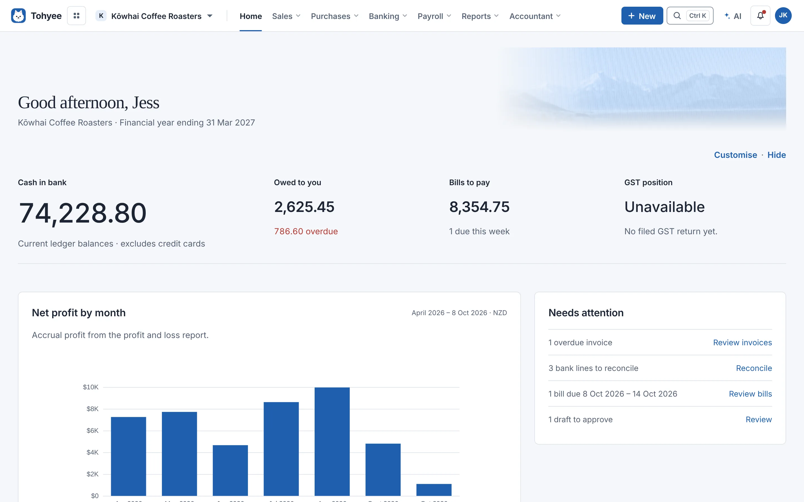
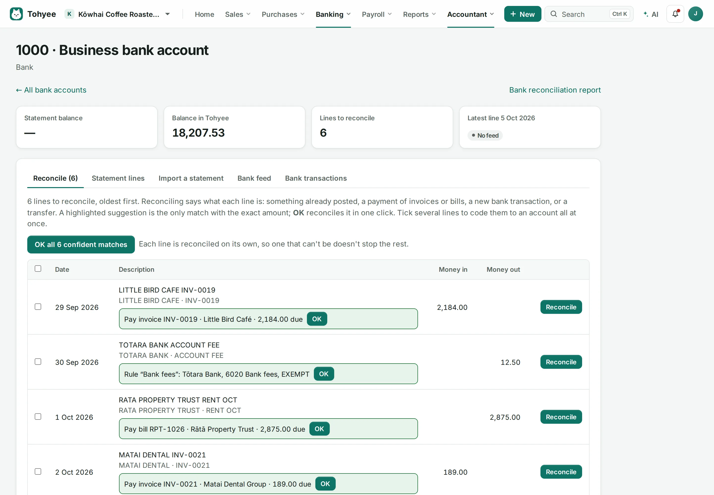
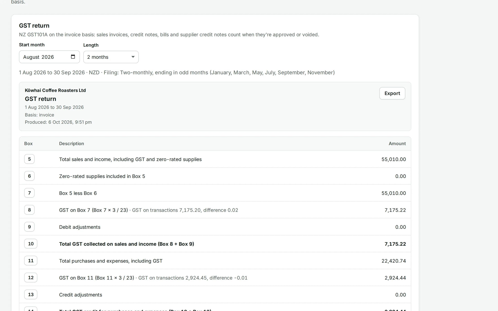
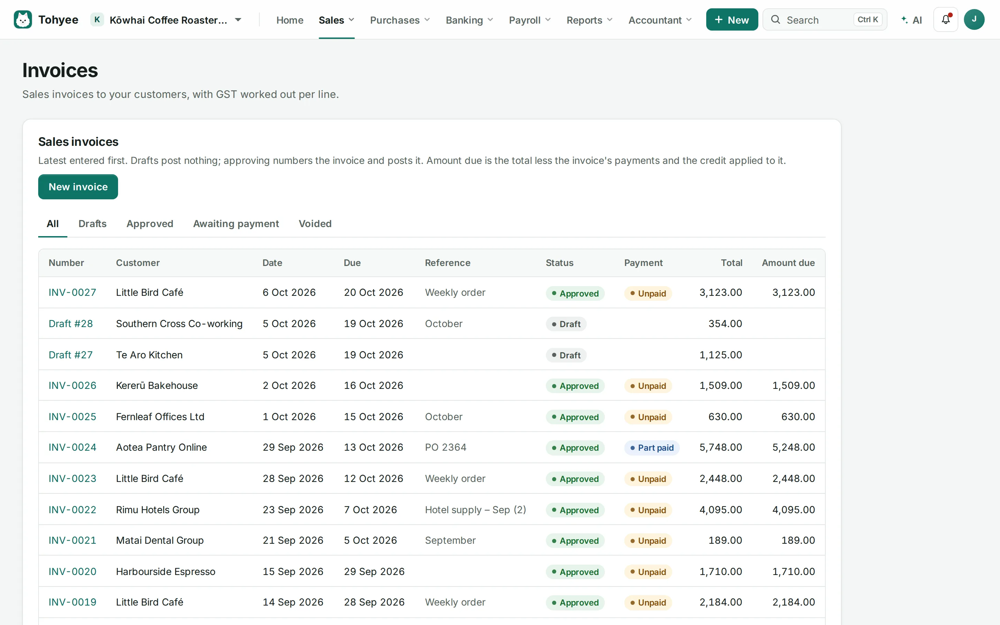
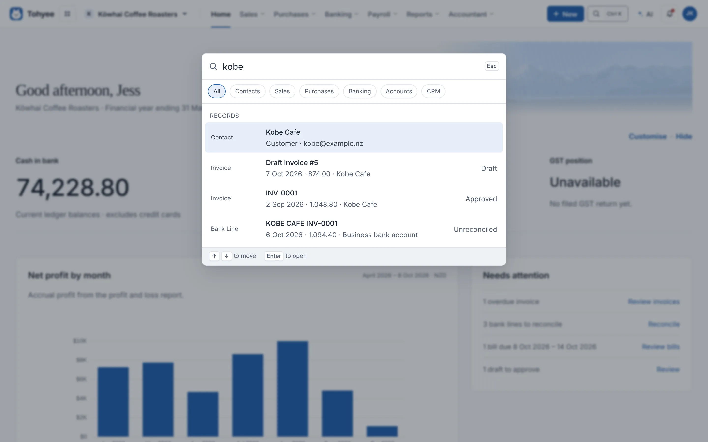

<p align="center">
  
</p>

<h1 align="center">Tohyee</h1>

<p align="center">
  <strong>Accounting that's yours.</strong><br />
  Free, open-source accounting for New Zealand: invoices, bank feeds, GST
  returns, payroll and reports, on your own computer with no monthly fee.
</p>

<p align="center">
  <a href="https://github.com/Willy-nz/Tohyee/releases/latest"></a>
  <a href="https://github.com/Willy-nz/Tohyee/actions/workflows/ci.yml"></a>
  <a href="LICENSE"></a>
</p>

<p align="center">
  <a href="https://willy-nz.github.io/Tohyee/"><strong>Website</strong></a> ·
  <a href="https://github.com/Willy-nz/Tohyee/releases/latest"><strong>Download</strong></a> ·
  <a href="docs/FEATURES.md">Features</a> ·
  <a href="https://github.com/Willy-nz/Tohyee/issues">Report a problem</a>
</p>

Tohyee keeps your books on a computer you control, like a media server at
home, with no monthly fee. One Tohyee server can hold many organisations, and
**each organisation gets its own PostgreSQL database**, so each can be backed
up, restored or moved on its own.

> **Status: early.** Everything listed below works and is covered by tests,
> but Tohyee is new. Try it on a test organisation before you put real books
> in it, and check your GST returns and reports before you rely on them.
> Tohyee is free software provided as is, with no warranty (see the
> [licence](LICENSE)).

**Just want to use it?** Download `TohyeeSetup` from the
[latest release](https://github.com/Willy-nz/Tohyee/releases/latest) and see
[Running on a server](#running-on-a-server). Everything else here is for
people working on the code.

<p align="center">
  
</p>

| | |
| --- | --- |
| **Bank feeds and reconciliation**<br />Akahu, SimpleFIN, Stripe, PayPal and Wise, or statement files; suggested matches are one click. | **GST, the NZ way**<br />The GST101A return box by box, with the documents behind every figure. |
|  |  |
| **Invoices and getting paid**<br />GST per line, gap-free numbering, Pay now links, and who owes what. | **Find anything with Ctrl K**<br />Every screen, contact, invoice and report from the keyboard. |
|  |  |

<sub>Screenshots show a fictional demo business, Kōwhai Coffee Roasters Ltd.</sub>

## What it does

**Sales**
- Quotes, invoices and credit notes, with GST worked out per line (tax
  exclusive, inclusive or no tax); numbered on approval with no gaps, and
  voided rather than deleted.
- Repeating invoices, payment terms, customer payments (one or several
  invoices at once), overpayments and refunds, and customer statements.
- Products and services, price levels, salespeople, and print or save as PDF.
- Email invoices, quotes, credit notes, purchase orders and statements (as
  PDFs, in HTML emails with the organisation's logo) from the organisation's
  own Microsoft 365, Outlook, Gmail or Google Workspace mailbox (signed in
  once), or any other email account.
- **Pay now** links on invoices through the organisation's own Stripe or
  PayPal account, with the payments recorded for you.
- Shopify and WooCommerce orders and refunds brought in as sales (and
  Shopify payouts, with their fees).

**Purchases**
- Bills (due dates from each supplier's payment terms), repeating bills,
  supplier credit notes, purchase orders billed in parts, paying one or
  several bills at once, and expense claims with mileage.
- A bills inbox (bills uploaded or read from a mailbox, made into drafts),
  warnings about possible duplicate bills, and approval rules for who
  approves what.

**Bank**
- Bank and credit card accounts. Import statements (CSV, Excel, OFX, QIF,
  CAMT.053, MT940), have statement files picked up from a folder or
  mailbox, or use a bank feed: Akahu for NZ banks, SimpleFIN for overseas
  banks, and Stripe, PayPal and Wise. Reconcile each line by matching, paying
  invoices or bills, spend or receive money, or a transfer. Bank rules (with
  conditions and split lines) and contact defaults fill in the usual ones.

**GST and reports**
- GST return (GST101A, boxes 5-15) on the invoice, payments or hybrid basis,
  with a GST audit report listing the documents behind every box, and a
  GST filing frequency setting (monthly, two-monthly or six-monthly).
- Trial balance (this year's income and expenses, earlier years' profit in
  retained earnings, as in NetSuite), profit and loss, balance sheet, account transactions, journal
  report, aged receivables and payables, budgets with budget vs actual, and
  custom reports with your own layout.
- A cash flow forecast, consolidation of several organisations (with
  exchange rates from the European Central Bank), and report commentary
  that the organisation's connected AI can suggest and a person checks.

**Accounting**
- A starting NZ chart of accounts, manual journals, corrections by reversal,
  and month-end and year-end close with a checklist (no closing journals). The database itself refuses unbalanced journals and edits
  to posted history.
- Stock at weighted-average cost per location, with transfers, stocktakes and
  landed cost. A fixed asset register with depreciation runs and disposals.
  Foreign-currency revaluation.
- Departments, classes and locations on every line, custom fields and custom
  segments, and projects with time tracking.

**Payroll**
- NZ payroll: employees, pay runs with PAYE, ACC, student loan, KiwiSaver
  and ESCT, Holidays Act leave, timesheets, payslips, bank files for paying
  wages, payday filing files for IRD, and payroll reports.

**Analytics**
- Data from CSV and Excel files, the books and CRM, shaped and shown
  in dashboards and pivots, pinned to pages, shared with clients, or emailed
  as reports.

**Everything else**
- A built-in CRM (companies, people, a pipeline, tasks) with Gmail and
  Microsoft 365 email and calendar sync.
- Notes, files and history on transactions and contacts.
- Logins with roles (owner, admin, bookkeeper, viewer) and two-step sign-in
  for everyone.
- Nightly encrypted backups, restore as a copy, and remote access.
- Works on phones: a ☰ menu and line editors that stack.

See [docs/FEATURES.md](docs/FEATURES.md) for the full list, what's
deliberately not built, and what's next.


## Run it locally

You need Node.js 22 or 24 and Docker (for PostgreSQL).

```bash
npm install
npm run db:start                  # PostgreSQL 17 on localhost:5432 (for development only)
cp .env.example .env.local        # then set SETUP_TOKEN to a long random value
npm run dev                       # http://localhost:3000
```

The first visit goes to **/setup**: enter the `SETUP_TOKEN` and create the
first server admin. Then, on the same computer, open the **server settings**
and create an organisation under **Organisations**. On Windows that's the
**Tohyee server app**: the Tohyee icon by the clock (it starts when you sign in
to Windows) or "Tohyee server settings" in the Start menu. Elsewhere it's
http://127.0.0.1:3001/server (the main port + 1). It gets its own database with a starting NZ chart of
accounts, and you're its owner.

Server settings (organisations, users, remote access, email, updates) only
open on the server computer itself: they're refused over the network and
through the Cloudflare Tunnel. On Windows the server app's icon also shows
whether Tohyee is running, and can restart it or back it up. Change the port with `TOHYEE_ADMIN_PORT`. In
Docker or on Linux, use the command-line tool instead, which does everything
the server settings do (see [Server settings from the command line](#server-settings-from-the-command-line)).

Database migrations run automatically when the server starts. To run them by
hand: `npm run db:migrate`.

## Checks

```bash
npm run lint
npm run typecheck
npm test                          # database tests need TEST_DATABASE_URL, see .env.example
npm run build
```

`npm test` includes the worked examples in
[docs/ACCOUNTING-EXAMPLES.md](docs/ACCOUNTING-EXAMPLES.md), run against a real
PostgreSQL database. CI runs all four checks on pull requests and pushes to
`main`, on Node 22 and 24 with PostgreSQL 17.

## Running on a server

**Windows:** download `TohyeeSetup-<version>.exe` from the
[latest release](https://github.com/Willy-nz/Tohyee/releases/latest) and run
it. It installs Tohyee with its own PostgreSQL (nothing else to install) as
two Windows services, `Tohyee` and `TohyeePostgres`, that start whenever the
computer starts, even before anyone signs in. The last page of the installer
shows the setup token for creating the first admin login. Open Tohyee at
http://localhost:3000 (Start menu: **Open Tohyee**). Backups run every night,
encrypted; **Back up Tohyee** in the Start menu (or **Back up now** in the
tray icon's menu) runs them straight away. Data and settings
live in `%ProgramData%\Tohyee` and are kept when you update or uninstall.
The installer is built and tested on Windows by
`.github/workflows/windows-installer.yml` from [`installer/windows`](installer/windows).

**Docker:** `tohyee-v<version>-windows-docker.zip` runs Tohyee in Docker
Desktop instead (see [`deploy/windows`](deploy/windows) and its
`README.txt`, including where the backups go). The image is `ghcr.io/willy-nz/tohyee:<version>`. It needs
`DATABASE_URL` (a PostgreSQL 15+ login that can create databases), for the
first run `SETUP_TOKEN`, and `TOHYEE_SECRET_KEY` (32+ random characters: it
turns on two-step sign-in and encrypts stored secrets; the installers create
it); it listens on port 3000.

**Linux without Docker:**

```bash
npm run build
npm run package:release           # dist/release/tohyee-v<version>-linux-x64.tar.gz
```

On the server, unpack the bundle, set `DATABASE_URL`, `TOHYEE_SECRET_KEY`
(and `SETUP_TOKEN` for the first run) in the environment, and start it with `PORT=3000 ./start.sh`.
Put it behind HTTPS (e.g. Caddy or nginx) if it's reachable beyond your own
network.

**From anywhere (phone or laptop):** there are three ways, and each gives
Tohyee an https address without opening ports on your router. Only one is on
at a time. On Windows they're on the Tohyee server app's **Remote access**
page, which shows the address with a QR code to scan with your phone.

- **A Tohyee address (recommended for most):** one click, no sign-up. Tohyee
  asks the Tohyee address service (run by the Tohyee project) for an address
  like `https://k7m2q9.tohyee.example` and runs Cloudflare's connector for it.
  Your books still stay on this computer; the address service never sees
  them. From the command line: `remote-access address --on`. The service
  address can be changed with `TOHYEE_ADDRESS_SERVICE_URL`. (The service isn't
  running yet; until it is, Tohyee says so.)
- **Your own domain (Cloudflare):** free for businesses; you need a domain on
  Cloudflare. In the server app, **Connect to Cloudflare** signs you in to
  Cloudflare in your browser, makes the tunnel, adds an address such as
  `https://books.example.nz` to your domain and turns it on. You can also
  paste a tunnel token from Cloudflare's dashboard (the server app, or
  `remote-access set --on --token` on the command line). The Windows installer
  and Docker image include Cloudflare's `cloudflared`; on Linux, install it or
  set `TOHYEE_CLOUDFLARED_PATH`.
- **Tailscale Funnel (Windows):** the simplest set-up: the server app installs
  Tailscale if needed (Windows asks for permission), you sign in to Tailscale
  once in your browser, and it turns on Funnel for Tohyee
  (`https://<computer>.<tailnet>.ts.net`). Tailscale's free plan is for
  non-commercial use only; businesses need a paid Tailscale plan (from US$8
  per user a month, see https://tailscale.com/pricing). Tohyee never sees your
  Tailscale login.

Whichever way, everyone signs in with a password and an authenticator app
(two-step sign-in), which is required whenever `TOHYEE_SECRET_KEY` is set (the
installers set it), and phone access can't be turned on without it. Set up
Email in the server settings too, for security alerts and lost-phone reset
links.

**Backups:** every night (2am by default) Tohyee backs up each organisation,
and its own database of users and settings, into files in the backup folder:
one sub-folder per organisation, encrypted with the server's
`TOHYEE_SECRET_KEY`, each checked after it's written, keeping the last 14
daily and 12 monthly backups. Point the folder at a OneDrive (or other
cloud-synced) folder to get copies off the computer. Restoring makes a copy of
the organisation, with the same people, so the current books are never
overwritten. It's all in the server settings under **Backups** (or
`backups ...` in the command-line tool). **Keep a copy of the backup key
somewhere safe that isn't the backup folder**: without it the backups can't be
opened. The server app's Backups tab shows the key (after your password) and
checks your saved copy when you paste it back; until someone has, server admins
see a reminder on every page. To restore on a new server, give the old
server's key when restoring (the new server keeps its own). pg_dump and pg_restore come with the Windows installer and the Docker
image; elsewhere they need to be on the PATH (or set `TOHYEE_PG_BIN`).

### Server settings from the command line

For Docker and Linux servers (and for anyone locked out), the command-line
tool covers organisations, users, remote access, email and updates. It works
straight against the database, on the server itself, and records each change
in the audit trail as `cli`. In Docker it's in the image:

```bash
docker compose exec tohyee node tohyee-admin.cjs help
docker compose exec tohyee node tohyee-admin.cjs organisations list
docker compose exec tohyee node tohyee-admin.cjs organisations create --id green-island --name "Green Island" --owner you@example.com
docker compose exec tohyee node tohyee-admin.cjs users set-password --email you@example.com
```

From a checkout of this repository (with `npm install` done and
`DATABASE_URL` pointing at the core database) it's `npm run admin -- <same
arguments>`. Passwords and tokens are read from `TOHYEE_PASSWORD`,
`TOHYEE_EMAIL_PASSWORD` and `TOHYEE_TUNNEL_TOKEN`, or asked for without
showing what you type. Remote access changes take effect when Tohyee next
starts, because the running server runs the tunnel.

**Releases:** pushing a `v*` tag builds a release bundle and attaches it to a
GitHub release (`.github/workflows/release-server-bundle.yml`); the tag must
match the version in `package.json`. Server admins can check for new releases
under **Updates**.

## Documentation

- [docs/ARCHITECTURE.md](docs/ARCHITECTURE.md): tenancy, logins and roles,
  migrations, financial integrity rules
- [docs/ACCOUNTING-EXAMPLES.md](docs/ACCOUNTING-EXAMPLES.md): worked examples
  with numbers (the acceptance tests)
- [docs/FEATURES.md](docs/FEATURES.md): scope and roadmap
- [docs/STYLE-GUIDE.md](docs/STYLE-GUIDE.md): code conventions
- [.github/copilot-instructions.md](.github/copilot-instructions.md): rules for
  AI coding agents

## API

JSON over HTTP. Every route needs a signed-in session cookie, except
`/api/health`, sign-in, sign-out and first-time setup. Organisation routes take
an `organisationId` and check your role in that organisation. Commands that
create things take an `idempotencyKey`, so retries are safe. Browser requests
that change something are refused if they come from another site (checked with
the `Origin` and `Sec-Fetch-Site` headers).

| Area | Routes |
| --- | --- |
| Auth | `GET/POST /api/auth/setup`, `POST /api/auth/login`, `POST /api/auth/logout`, `GET /api/auth/session`, `POST /api/auth/password` |
| Server admin | `GET/POST /api/admin/organisations`, `PATCH /api/admin/organisations/:id`, `POST /api/admin/organisations/:id/repair`, `GET/POST /api/admin/users`, `PATCH /api/admin/users/:id`, `GET /api/updates/latest-release` |
| Organisation | `GET/PATCH /api/organisations/:id/settings`, `GET/POST /api/organisations/:id/members`, `PATCH/DELETE /api/organisations/:id/members/:userId` |
| Accounts | `GET/POST /api/accounts`, `PATCH /api/accounts/:id` |
| Contacts | `GET/POST /api/contacts`, `PATCH /api/contacts/:id` |
| Invoices | `GET/POST /api/invoices` (`?awaitingPayment=true` for approved invoices with an amount due, `?contactId=` for one customer's), `GET/PATCH/DELETE /api/invoices/:id` (GET includes the credit applied), `POST /api/invoices/:id/approve`, `POST /api/invoices/:id/void` |
| Customer payments | `GET/POST /api/invoices/:id/payments`, `POST /api/invoices/:id/payments/:paymentId/void` |
| Sales credit notes | `GET/POST /api/credit-notes` (`?status=`, `?contactId=`, `?hasRemainingCredit=true`), `GET/PATCH/DELETE /api/credit-notes/:id`, `POST /api/credit-notes/:id/approve`, `POST /api/credit-notes/:id/void`, `GET/POST /api/credit-notes/:id/applications`, `POST /api/credit-notes/:id/applications/:applicationId/remove`, `GET/POST /api/credit-notes/:id/refunds`, `POST /api/credit-notes/:id/refunds/:refundId/void` |
| Bills | `GET/POST /api/bills` (`?status=` filters by draft, approved or voided; `?awaitingPayment=true` for approved bills with an amount due; `?contactId=`), `GET/PATCH/DELETE /api/bills/:id` (`GET` includes the credit applied), `POST /api/bills/:id/approve`, `POST /api/bills/:id/void` |
| Supplier payments | `GET/POST /api/bills/:id/payments`, `POST /api/bills/:id/payments/:paymentId/void` |
| Supplier credit notes | `GET/POST /api/supplier-credit-notes` (`?status=`, `?contactId=`, `?hasRemainingCredit=true`), `GET/PATCH/DELETE /api/supplier-credit-notes/:id`, `POST /api/supplier-credit-notes/:id/approve`, `POST /api/supplier-credit-notes/:id/void`, `GET/POST /api/supplier-credit-notes/:id/applications`, `POST /api/supplier-credit-notes/:id/applications/:applicationId/remove`, `GET/POST /api/supplier-credit-notes/:id/refunds`, `POST /api/supplier-credit-notes/:id/refunds/:refundId/void` |
| Ledger | `GET/POST /api/ledger/journals`, `GET /api/ledger/journals/:id`, `POST /api/ledger/journals/corrections`, `GET/PATCH /api/ledger/period-controls`, `GET/POST /api/ledger/revaluations` |
| Stock | `GET/POST /api/inventory/movements` |
| Reports | `GET /api/reports/trial-balance`, `/profit-and-loss`, `/balance-sheet`, `/inventory-valuation` |
| GST return | `GET/POST /api/reports/gst-return` (`?periodStart=&periodEnd=`; `POST` works it out with `adjustments`), `GET/POST /api/gst-returns` (`POST` marks a return as filed, admins), `GET /api/gst-returns/:id` |
| Notes, files and history | `GET /api/records/:type/:id` (type: `journal`, `invoice`, `bill`, `credit-note`, `supplier-credit-note`, `contact`), `POST /api/records/:type/:id/notes`, `PATCH/DELETE /api/records/:type/:id/notes/:noteId`, `POST /api/records/:type/:id/attachments` (multipart `file`), `GET/DELETE /api/records/:type/:id/attachments/:attachmentId` |
| Tax | `GET/POST /api/tax/codes` |
| Health | `GET /api/health` |

## Contributing

Issues and pull requests are welcome. Please read
[docs/ARCHITECTURE.md](docs/ARCHITECTURE.md) and
[docs/STYLE-GUIDE.md](docs/STYLE-GUIDE.md) first. Accounting behaviour needs a
worked example with numbers in
[docs/ACCOUNTING-EXAMPLES.md](docs/ACCOUNTING-EXAMPLES.md) and a test, and all
four checks above must pass.

## Licence

[GNU AGPL v3](LICENSE). The Tohyee logo (a Japanese Spitz) is `assets/logo.svg`.
